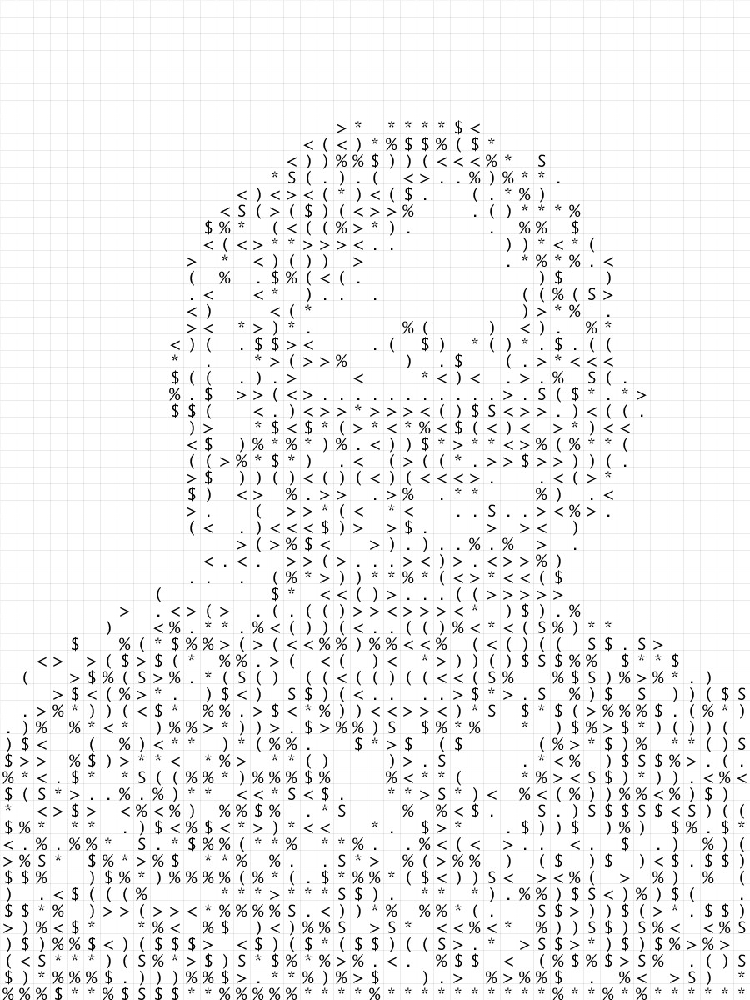

# ImageNumberizer
Converts given images to an ASCII art like graph using the brightness values of the given input

# How to use?
Download or clone this repository, head over to http://processing.org/ and download the latest IDE version. Within the   `sketch/data` folder you can replace the image with your own. 

# Test Image 1

By LANL - http://www.lanl.gov/history/atomicbomb/images/NeumannL.GIF (archive copy at the Wayback Machine (archived on 11 March 2010)), Public Domain, https://commons.wikimedia.org/w/index.php?curid=3429594

